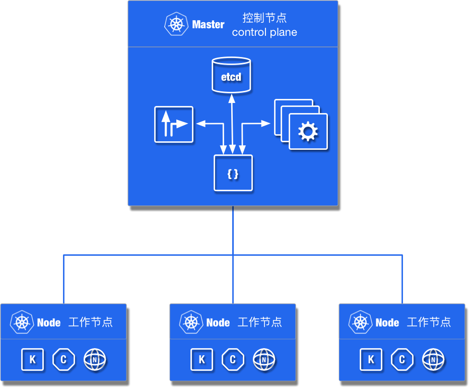
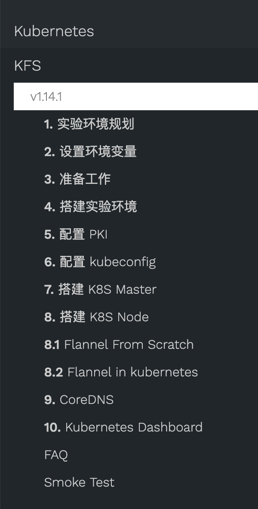

# KFS

KFS 是 **K**ubernetes **F**rom **S**cratch 的缩写，项目命名学习 LFS (**L**inux **F**rom **S**scrath)

## Kubernetes

## KFS 手册

最新文档地址 [https://kfs.ooclab.com/kfs/v1.14.1/](https://kfs.ooclab.com/kfs/v1.14.1/)

